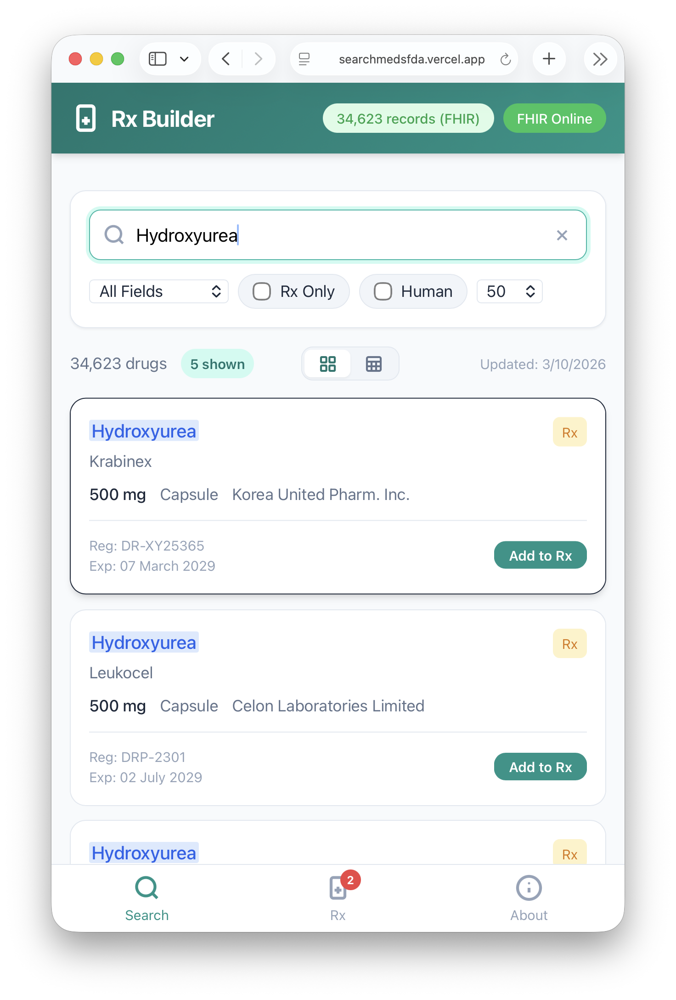
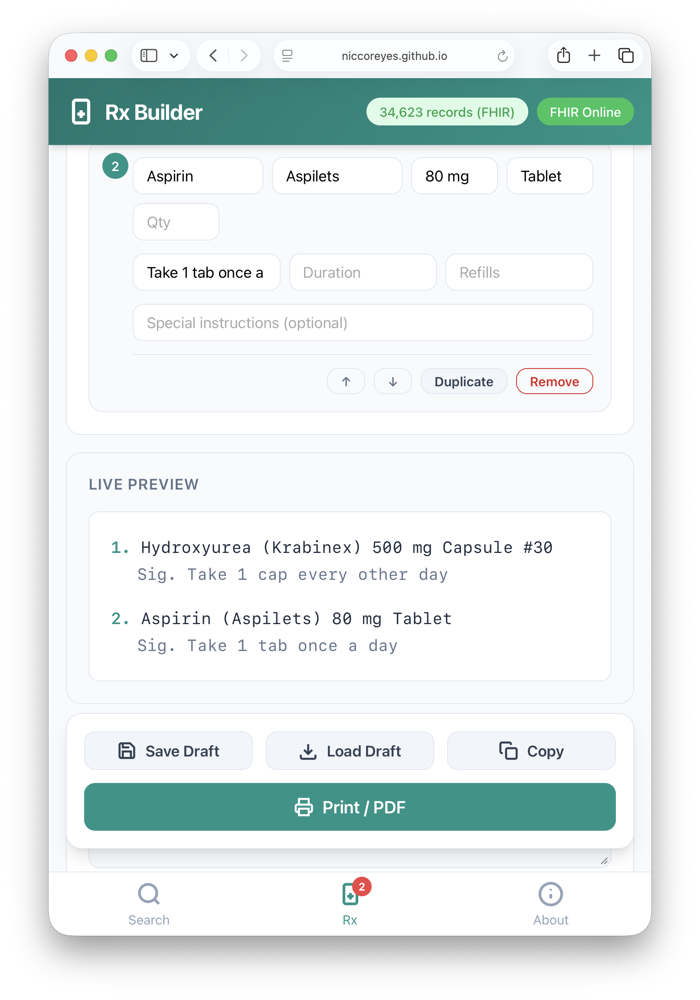

# Rx Builder

A modern, **mobile-first prescription builder** with integrated Philippine FDA drug search. Built with pure vanilla JavaScript — no frameworks, no build step, no backend required. Designed for healthcare professionals who need fast, offline-capable drug lookup and prescription generation.

<table border="0">
  <tr>
    <td></td>
    <td></td>
  </tr>
</table>

## Features

- **Dual Data Sources**: Load from FHIR terminology server (online) or local CSV (offline)
- **Smart Search**: Cross-field search (e.g., "Amlo Exfo" finds Amlodipine + Exforge)
- **Prescription Builder**: Add medications, set quantities, directions, notes
- **Live Preview**: See formatted prescription as you build
- **Print/PDF Ready**: Optimized print stylesheet for professional output
- **Draft Save/Load**: Persist prescriptions to browser localStorage
- **Mobile Optimized**: Bottom navigation, responsive cards, touch-friendly UI
- **Privacy First**: All processing happens client-side; no data leaves your device

## Quick Start

Open `index.html` in any modern browser, or deploy to Vercel for instant access.

```bash
# Optional: Install dependencies for FHIR terminology tools
bun install

# Generate FHIR terminology files from CSV
bun run generate-fhir-terminology.ts
```

## Architecture

Rx Builder follows a **deliberately minimal, client-only architecture** with zero external runtime dependencies. The entire application runs in a single HTML file with vanilla JavaScript and CSS.

### Module Relationships

```
┌────────────────────────────────────────────────────────────────────┐
│                        index.html                                  │
│  ┌─────────────────┐  ┌─────────────────┐  ┌─────────────────┐     │
│  │  View: Search   │  │   View: Rx      │  │  View: About    │     │
│  │  ─────────────  │  │   ──────────    │  │  ────────────   │     │
│  │                 │  │                 │  │                 │     │
│  │ • Upload Area   │  │ • Prescriber    │  │ • How It Works  │     │
│  │ • Search Bar    │  │   Info Form     │  │ • FHIR Server   │     │
│  │ • Filters       │  │ • Patient Form  │  │   Details       │     │
│  │ • Results List  │  │ • Quick Add     │  │ • Privacy Info  │     │
│  │ • Pagination    │  │ • Rx Items List │  │                 │     │
│  │                 │  │ • Live Preview  │  │                 │     │
│  │                 │  │ • Print Actions │  │                 │     │
│  └────────┬────────┘  └────────┬────────┘  └─────────────────┘     │
│           │                    │                                   │
│           └────────────────────┘                                   │
│                     │                                              │
│                     ▼                                              │
│           ┌─────────────────────┐                                  │
│           │  Bottom Navigation  │                                  │
│           │  (switchTab)        │                                  │
│           └────────┬────────────┘                                  │
│                    │                                               │
└────────────────────┼───────────────────────────────────────────────┘
                     │
                     ▼
┌─────────────────────────────────────────────────────────────────────┐
│                        main.js                                      │
├─────────────────────────────────────────────────────────────────────┤
│                                                                     │
│  ┌──────────────────────────────────────────────────────────────┐   │
│  │                    CORE MODULES                              │   │
│  │                                                              │   │
│  │  ┌──────────────┐  ┌──────────────┐  ┌──────────────┐        │   │
│  │  │ Data Loading │  │ Search/Index │  │  Rx Manager  │        │   │
│  │  │ ──────────── │  │ ──────────── │  │ ──────────── │        │   │
│  │  │              │  │              │  │              │        │   │
│  │  │ initCSVLoad()│  │ initSearch() │  │ initRxForm() │        │   │
│  │  │ tryFHIRLoad()│  │ buildQuick   │  │ addRxItem()  │        │   │
│  │  │ parseAndLoad │  │   Index()    │  │ removeItem() │        │   │
│  │  │   CSV()      │  │ filterAnd    │  │ updateQty()  │        │   │
│  │  │ convertFHIR  │  │   Render()   │  │ updateDir()  │        │   │
│  │  │   Concepts.. │  │ sortResults()│  │ saveDraft()  │        │   │
│  │  │              │  │ renderCards()│  │ loadDraft()  │        │   │
│  │  │              │  │ renderTable()│  │ clearItems() │        │   │
│  │  └──────┬───────┘  └──────┬───────┘  └──────┬───────┘        │   │
│  │         │                 │                 │                │   │
│  │         └─────────────────┼─────────────────┘                │   │
│  │                           │                                  │   │
│  │                           ▼                                  │   │
│  │                  ┌─────────────────┐                         │   │
│  │                  │  SHARED STATE   │                         │   │
│  │                  │  (state object) │                         │   │
│  │                  └─────────────────┘                         │   │
│  └──────────────────────────────────────────────────────────────┘   │
│                                                                     │
│  ┌──────────────────────────────────────────────────────────────┐   │
│  │                   UTILITY MODULES                            │   │
│  │                                                              │   │
│  │  ┌──────────────┐  ┌──────────────┐  ┌──────────────┐        │   │
│  │  │   Toast UI   │  │  Navigation  │  │ Print System │        │   │
│  │  │ ──────────── │  │ ──────────── │  │ ──────────── │        │   │
│  │  │              │  │              │  │              │        │   │
│  │  │ showToast()  │  │ switchTab()  │  │ doPrint()    │        │   │
│  │  │ clearToasts()│  │ initNav()    │  │ copyRx()     │        │   │
│  │  │              │  │              │  │ #rxPrint     │        │   │
│  │  └──────────────┘  └──────────────┘  └──────────────┘        │   │
│  │                                                              │   │
│  │  ┌──────────────┐  ┌──────────────┐                          │   │
│  │  │   Helpers    │  │   Parsers    │                          │   │
│  │  │ ──────────── │  │ ──────────── │                          │   │
│  │  │              │  │              │                          │   │
│  │  │ escapeHTML() │  │ CSVToArray() │                          │   │
│  │  │ debounce()   │  │ parseCSV()   │                          │   │
│  │  │ $, $$ DOM    │  │              │                          │   │
│  │  └──────────────┘  └──────────────┘                          │   │
│  └──────────────────────────────────────────────────────────────┘   │
│                                                                     │
└─────────────────────────────────────────────────────────────────────┘
```

**For detailed architecture documentation including data flows, state machines, and pipeline diagrams, see [ARCHITECTURE.md](ARCHITECTURE.md).**

### Architecture Highlights

- **Zero-dependency, vanilla JavaScript** approach
- **Single-file application** structure (`index.html` + `main.js` + `styles.css`)
- **Client-side FHIR terminology** consumption via `tx.fhirlab.net`
- **Dual offline/online data loading** strategy with automatic fallback
- **State management** through a central `state` object
- **Search indexing** for performance on 34K+ records

## File Structure

```
searchmedsfda/
├── index.html              # Main application (single file)
├── main.js                 # All JavaScript logic (~1500 lines)
├── styles.css              # All styles (mobile-first, responsive)
├── ALL_DrugProducts.csv    # Local drug database (CSV)
│
├── ARCHITECTURE.md         # Detailed technical documentation
├── generate-fhir-          # FHIR terminology generator
│   terminology.ts          # (Converts CSV → FHIR resources)
│
├── cleanup-terminology.ts  # Cleanup script for FHIR server
│
├── fhir-terminology/       # Generated FHIR resources
│   ├── ph-fda-codesystem.json   # ~48MB, 34K+ concepts
│   ├── ph-fda-valueset.json     # ValueSet definition
│   └── summary.json             # Generation statistics
│
├── FHIR_TERMINOLOGY_       # Documentation for FHIR
│   UPLOAD.md               # server integration
│
├── package.json            # Node/Bun dependencies
├── tsconfig.json           # TypeScript config
└── images/                 # Screenshots for README
    ├── medication_search.png
    └── prescription.png
```

## Data Sources

### Option 1: FHIR Terminology Server (Online)

The app connects to `tx.fhirlab.net/fhir` (powered by Ontoserver on FHIRLab) to fetch the complete Philippine FDA drug database using FHIR R4 terminology resources.

**Resources:**
- **CodeSystem** (`TestPHFDACPRCS`): Contains all 34,000+ drug products with properties
- **ValueSet** (`TestPHFDACPRVS`): Defines the complete set of valid codes

**Direct Links:**
- 👉 CodeSystem: https://tx.fhirlab.net/fhir/CodeSystem/TestPHFDACPRCS
- 👉 ValueSet: https://tx.fhirlab.net/fhir/ValueSet/TestPHFDACPRVS

**Properties per Concept:**
- `genericName` - Generic/INN name
- `brandName` - Brand name
- `dosageStrength` - Strength/concentration
- `dosageForm` - Tablet, Injection, etc.
- `classification` - RX, OTC, etc.
- `manufacturer` - Drug manufacturer
- `expiryDate` - Registration expiry

### Option 2: CSV File (Offline)

Load the `ALL_DrugProducts.csv` file locally for complete offline operation. The CSV parser handles:
- Quoted fields with embedded commas
- Header mapping
- Automatic type conversion
- Drag-and-drop file loading

## Development

```bash
# Install dependencies
bun install

# Generate FHIR terminology from CSV
bun run generate-fhir-terminology.ts

# Cleanup FHIR server (if needed)
bun run cleanup-terminology.ts
```

### FHIR Terminology Generation

The `generate-fhir-terminology.ts` script converts the CSV drug database into standard FHIR R4 terminology resources:

1. Reads `ALL_DrugProducts.csv`
2. Maps columns to FHIR CodeSystem properties
3. Generates unique codes (Registration Numbers)
4. Outputs:
   - `fhir-terminology/ph-fda-codesystem.json` (~48MB)
   - `fhir-terminology/ph-fda-valueset.json`
   - `fhir-terminology/summary.json`

See `FHIR_TERMINOLOGY_UPLOAD.md` for upload instructions to the FHIR server.

## Deployment

Since the app is a single HTML file with no build step:

**Deploy to Vercel:**

1. Push to GitHub (if not already done)
2. Deploy via Vercel CLI:
   ```bash
   npm i -g vercel
   vercel
   ```
3. Or use the Vercel dashboard at [vercel.com](https://vercel.com) to import your repo

No build configuration needed. Vercel auto-detects it as a static site.

**Other Options:**
- **Static Host**: Upload `index.html`, `styles.css`, `main.js`
- **Local**: Open `index.html` in browser

## Privacy & Security

- **Zero data transmission**: All processing happens client-side
- **No cookies or tracking**
- **LocalStorage only**: Used for draft prescriptions
- **FHIR server**: Read-only access to public terminology server
- **CSV files**: Never uploaded anywhere

## Contributing

PRs welcome for:
- Search improvements
- UI/UX enhancements
- Accessibility improvements
- Additional export formats

## License

MIT (or specify your preferred license)

---

**Data Source**: FDA Philippines Drug Products Database
**FHIR Server**: FHIRLab / tx.fhirlab.net (powered by Ontoserver)
**Developer**: Thomas Reyes
